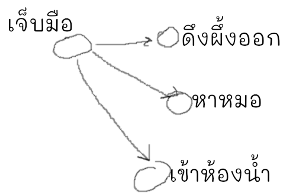

กาลครั้งหนึ่งไม่นานมานี้ (1943) คนฉลาดสองคนนั่งคิดกันว่าถ้าเราทำให้คอมพิวเตอร์คิดเหมือนกับเราได้ มันคงฉลาดเหมือนเรา ตู้ม!~ เกิดเป็น Neural Networks

แล้วกระบวนการคิดของเราเป็นยังไง?

[รูป neuron]

ในสมองของเราเต็มไปด้วยตัว neuron ในรูป พอตัวนึงถูกกระตุ้นด้วยกระแสไฟฟ้ามันก็จะส่งกระแสไฟฟ้าไปกระตุ้นตัวต่อไป พวกนี้เชื่อมกันระโยงระยางส่งสัญญาณไฟฟ้าให้กันมั่วไปหมด
แต่ neuron ไม่จำเป็นต้องส่งสัญญาณไปต่อทุกครั้งที่ได้รับสัญญาณมาก็ได้ บางทีสัญญาณนั้นไม่เกี่ยวกับมัน ยกตัวอย่างง่ายๆ

สมมุติว่าทั้งสมองเรามี neuron แค่ 5 ตัวนี้
จู่ๆปลายประสาทที่มือเราถูกกระตุ้น มันก็ส่งสัญญาณมาที่สมอง มาถึง "neuron เจ็บมือ" และเนื่องจาก "neuron เจ็บมือ" สนใจเรื่องมือเจ็บ ทำให้ "neuron เจ็บมือ"ถูกกระตุ้นมากพอที่จะส่งสัญญาณต่อไป "neuron เจ็บมือ"ตัวนี้เชื่อมกับ neuron อีกสี่ตัวทางด้านขวา
"neuron เจ็บมือ"ก็ส่งข่าวไปยัง neuron ปลายทางทั้งหมด (มันไม่ฉลาดพอที่จะเลือกส่งไปตัวใดตัวหนึ่ง)

This is my first post on my new fake blog! How exciting!

I'm sure I'll write a lot more interesting things in the future.

Oh, and here's a great quote from this Wikipedia on
[salted duck eggs](http://en.wikipedia.org/wiki/Salted_duck_egg).

> A salted duck egg is a Chinese preserved food product made by soaking duck
> eggs in brine, or packing each egg in damp, salted charcoal. In Asian
> supermarkets, these eggs are sometimes sold covered in a thick layer of salted
> charcoal paste. The eggs may also be sold with the salted paste removed,
> wrapped in plastic, and vacuum packed. From the salt curing process, the
> salted duck eggs have a briny aroma, a gelatin-like egg white and a
> firm-textured, round yolk that is bright orange-red in color.

